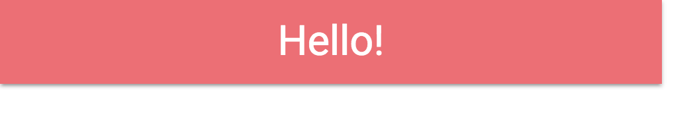
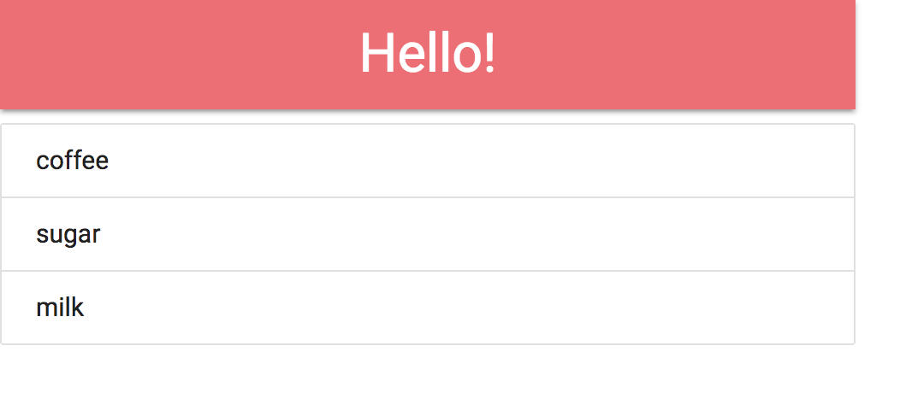
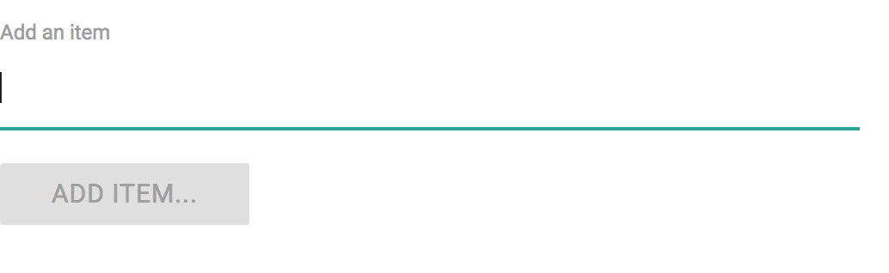
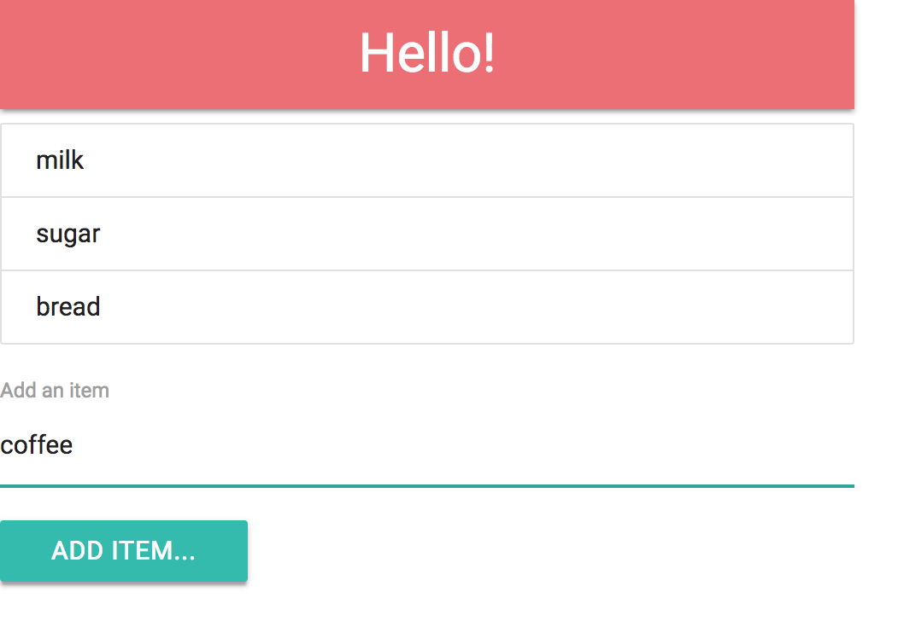

React basics
============

This module contains a demonstration of basic React usage. No prior knowledge of React is assumed.


Agenda
------
* A brief walk through the various parts of a React project structure.
* Demo of basic React syntax
* Properties
* State
* A challenge


Project structure
-----------------
* Every NodeJS project contains a **`package.json`** file that contains
    * the name, a description and SCM related information about the project
    * script shortcuts
    * a list of dependencies
* When running `npm install` for the first time, a **`package-lock.json`** file is generated. **DON'T EDIT THIS FILE!**
  This file contains the exact dependencies that the project uses. It is therefore important to commit this file, such
  that all contributors of the project use the same dependency versions. When new dependencies are installed, this file
  will be automatically updated/regenerated.
* For TypeScript projects, a **`tsconfig.json`** file is included. This file contains configuration specific to how the
  TypeScript compiler is to behave and which level of strictness is expected.
* The **`/webpack`** folder contains all Webpack configuration. This project contains two configurations:
  development (**`dev.config.js`**) and production (**`prod.config.js`**), both sharing a number of settings in
  **`base.config.js`**. These settings include the application's entry point(s), file extensions to be resolved and
  build configurations.
* A very basic HTML page is contained in **`src/main/html/index.html`**. This contains a `header` with all necessary
  details, such as `title`, `meta` elements and `link`s to external CSS and/or JavaScript libraries, such as Bootstrap
  or MaterializeCSS.  The HTML's `body` element only contains a `<div id="app"></div>`. This is where React will in the
  end put the generated HTML. Please note that this HTML file does not contain references to our own JavaScript or CSS.
  This will later be injected by Webpack.
* Styling and other resources (images, etc.) will be put into **`src/main/resources/`**. Please note that in order for
  these files to be used, they must be referenced by the (Java|Type)Script sources.
* **`src/main/typescript/index.tsx`** is the root of the application's code. This file makes sure that our custom CSS is
  linked to the application (`import "../resources/css/styling"`) and that the generated HTML is put into the `#app`
  inside the HTML.


React basic syntax
------------------
In this section we look at React's syntax and create a styled header in the process.

React separates its various UI elements into 'components'. Every React UI element therefore extends `React.Component`.
Usually the convention is to create one file per UI element (except if the elements are closely related to each other).
Each file starts by doing some imports and the class definition. A React `Component` always has a `render` function
that returns the DOM elements to be shown in the browser. Finally, the UI element is exported, such that it can be
used outside of the file it is defined in.

```diff
import * as React from "react"
import { Component } from "react"

class App extends Component {
    render() {
        return <h1>Hello!</h1>
    }
}

export default App
```

Note that it seems that you're writing HTML directly in the `return` statement of the `render` function. This is,
however, only syntactic sugar that generates a virtual DOM element in the (Java|Type)Script code. In order to use this,
make sure to change the file extension from `*.js` to `*.jsx` and from `*.ts` to `*.tsx`.

The above code will generate a simple header in the browser:


### Header
In this demo we will be using [MaterializeCSS](http://materializecss.com/). To create a Header using this CSS library,
we need to write enough code to justify creating a separate (reusable) component. One notable difference with 'normal'
HTML/CSS is that we need to use the `className` attribute instead of the regular `class` attribute.

```typescript
import * as React from 'react'
import { Component } from "react"

class Header extends Component {
  render() {
    return (
      <nav>
        <div className="nav-wrapper">
          <a className="brand-logo center">Hello!</a>
        </div>
      </nav>
    )
  }
}

export default Header
```

Then, in `App.tsx` we reference this component inside its `render` method:

```diff
import * as React from "react"
import { Component } from "react"
+import Header from "./Header"

class App extends Component {
    render() {
-        return <h1>Hello!</h1>
+        return <Header/>
    }
}

export default App
```

The above code will generate a header styled with MaterializeCSS in the browser:


### Header with custom text
The problem with this implementation of `Header` is that it can only show `Hello!` and nothing else. To give a custom
text, we want to use the same syntax as with an `<h1>`, namely `<Header>Hello!</Header>`. The text inside these tags
can be reached in the `Header` component using `this.props.children`.

```diff
import * as React from 'react'
import { Component } from "react"

class Header extends Component {
  render() {
    return (
      <nav>
        <div className="nav-wrapper">
-          <a className="brand-logo center">Hello!</a>
+          <a className="brand-logo center">{this.props.children}</a>
        </div>
      </nav>
    )
  }
}

export default Header
```

Now you can use this improved `Header` in `App`:

```diff
import * as React from "react"
import { Component } from "react"
import Header from "./Header"

class App extends Component {
    render() {
-        return <Header/>
+        return <Header>Hello!</Header>
    }
}

export default App
```


Interlude: model
----------------
In the rest of this demo, we are going to create a simple shopping list application. For that we need to define a
shoppinglist item (we will call the related UI element `ShoppingListItem`, so to avoid name collisions we will call
this model `Item`). This object has two properties: a unique identifier and a display value. For the former we will use
a UUID generator. Since this functionality is available in the `uuid` library, we need to install this using `npm`.
Note that, since we're using TypeScript, we also need to install the `@types` package as a `devDependency`.
The following two commands make sure that these dependencies will be added to `package.json`. Also don't forget to
restart the development server after an install: `npm start`!

    npm i -S uuid
    npm i -D @types/uuid

Now we can use the UUID generator while defining the `Item` model. Please note that the `id` has a default argument,
so `new Item("milk")` will create an `Item` with `id = uuid()`.

```typescript
import * as uuid from 'uuid/v4'

export class Item {
    public readonly id: string
    public readonly value: string

    constructor(value: string, id: string = uuid()) {
        this.id = id
        this.value = value
    }
}
```

Since the `ShoppingListItem` UI element that represents the `Item` model will be part of a list, we can define it as a
reusable component with a `li` element. The content of this `li` will be the text in `Item.value`. 

```typescript
import * as React from 'react'
import { Component } from "react"

class ShoppingListItem extends Component {
    render() {
        return (
            <li className='collection-item'>{this.props.children}</li>
        )
    }
}

export default ShoppingListItem
```


Properties
----------
The list of items on the shoppinglist is used by a new ui element `ShoppingList`, which renders all `Item`s in an
unordered list. We can therefore say that the `Item`s are a 'property' of `ShoppingList`. In fact, we have already seen
the properties a couple of times with `this.props.children`. Every `Component` by default comes with a property called
`children`. In order to add other, custom properties, we must specify that in an interface and pass this along to
the `Component`.

We use the the convention that this properties interface has the name `[ComponentName]Props`. Inside we define all
properties and their types; in this case `items` of type `Item[]`. We give this `ShoppingListProps` as a type parameter
(or generic) to the `Component` class that we extend from in `ShoppingList`. Note that we now also define a constructor
to pass the received properties to the constructor of `Component`. When this is the only thing that is done in the
constructor, we do not necessarily have to write this constructor, but for the purposes of this demo we will leave it in.

```typescript
import * as React from "react"
import { Component } from "react"
import { Item } from "../model/Item"

interface ShoppingListProps {
    items: Item[]
}

class ShoppingList extends Component<ShoppingListProps> {
    constructor(props: ShoppingListProps) {
        super(props)
    }

    render() {
        return null
    }
}

export default ShoppingList
```

When using `ShoppingList` we are now required to also provide a property `items`. Note that this is 'just an attribute'
in the `<ShoppingList/>` HTML tag.

```diff
import * as React from "react"
import { Component } from "react"
import Header from "./Header"
+import ShoppingList from "./ShoppingList"
+import { Item } from "../model/Item"

class App extends Component {
    render() {
-        return <Header>Hello!</Header>
+        return (
+            <div>
+                <Header>Hello!</Header>
+                <ShoppingList items={[
+                    new Item("coffee"),
+                    new Item("sugar"),
+                    new Item("milk"),
+                ]}/>
+            </div>
+        )
    }
}

export default App
```

Now for the implementation of the `render` function in `ShoppingList`. If there are no items in the `items` array,
we don't want to render the list at all. However, if there are any items in the list, we must render a `ShoppingListItem`
for each `item` in `items`. For this conditional we can either use an if-else construction, or use a ternary operator
as is used in the code below.

When rendering the `<ul/>`, we access the `items` using `this.props.items` and map over them to create instances of the
`ShoppingListItem`. Notice that we provide an extra `key={item.id}` for each of them. This is an attribute that React
requires for a list to be correctly rendered. These keys must be unique in the list and are used to optimize rendering
the list's items.

```diff
import * as React from "react"
import { Component } from "react"
import { Item } from "../model/Item"
import ShoppingListItem from "./ShoppingListItem"

interface ShoppingListProps {
    items: Item[]
}

class ShoppingList extends Component<ShoppingListProps> {
    constructor(props: ShoppingListProps) {
        super(props)
    }

    render() {
-        return null
+        const isEmpty = this.props.items.length == 0
+        const shoppingList = isEmpty
+            ? <div/>
+            : <ul className="collection">
+                {this.props.items.map(item => <ShoppingListItem key={item.id}>{item.value}</ShoppingListItem>)}
+            </ul>
+
+        return shoppingList
    }
}

export default ShoppingList

```

The above code in `App` will now generate both a header and a list in the browser:



State
-----
In order to add new items to our shoppinglist, we require a little form. It will consist of one textfield and one button.



Thinking about this from a technical perspective, the text contained in a form field is part of the state of this form.
State is, just like properties, defined in a separate interface and added as a generic parameter to the `Component`.
Note that in the constructor the state needs to be initialized with a default value. This state can be initialized with
the empty string, since the form field is initially empty.

In the render function we define the form with a label, textfield and submit button. We set the value of the textfield
equal to the current state that is defined in `FormState`. We also check for emptiness of the state and disable the
button if that is the case.

```typescript
import * as React from "react"
import { Component } from "react"

interface FormProps {
}

interface FormState {
    value: string
}

class Form extends Component<FormProps, FormState> {
    constructor(props: FormProps) {
        super(props)
        this.state = { value: "" }
    }

    render() {
        return (
            <form>
                <div>
                    <label>Add an item</label>
                    <input type="text"
                           value={this.state.value}
                           autoFocus/>
                </div>
                <button className="btn waves-effect waves-light"
                        type="submit"
                        disabled={this.state.value.length === 0}>Add item...</button>
            </form>
        )
    }
}

export default Form
```

We also add `Form` to the `App` component to be displayed.

```diff
import * as React from "react"
import { Component } from "react"
import Header from "./Header"
import ShoppingList from "./ShoppingList"
import { Item } from "../model/Item"
+import Form from "./Form"

class App extends Component {
    render() {
        return (
            <div>
                <Header>Hello!</Header>
                <ShoppingList items={[
                    new Item("coffee"),
                    new Item("sugar"),
                    new Item("milk"),
                ]}/>
+                <Form />
            </div>
        )
    }
}

export default App
```

At this moment you can type into the textfield, although the text inside it is not updated. The is because we have set
the value of the field, but we did not yet define what should happen when we type some text into the field. This is
done using the `onChange` attribute of the `<input/>`, which we need to connect to the state. When we type text in the
field, the text needs to be changed, which would cause the `<input/>` to be updated, such that it displays the correct
text.

To do so, we create an event handler `handleChange` which calls `this.setState` to set the new state. We also add this
function to the `<input/>`.

```diff
import * as React from "react"
import { Component } from "react"

interface FormProps {
}

interface FormState {
    value: string
}

class Form extends Component<FormProps, FormState> {
    constructor(props: FormProps) {
        super(props)
        this.state = { value: "" }
    }
    
+    handleChange = (event: React.ChangeEvent<FormState>) => {
+        event.preventDefault()
+        this.setState({ value: event.target.value })
+    }

    render() {
        return (
            <form>
                <div>
                    <label>Add an item</label>
                    <input type="text"
                           value={this.state.value}
+                           onChange={this.handleChange}
                           autoFocus/>
                </div>
                <button className="btn waves-effect waves-light"
                        type="submit"
                        disabled={this.state.value.length === 0}>Add item...</button>
            </form>
        )
    }
}

export default Form
```

Now we are able to type text in the field and get it displayed on the screen as well.

The next step would be to submit this form and add the text as a new element to the shoppinglist. For this we require
a new type of state, namely the current list of `Item`s that need to be displayed by the `ShoppingList` component.
We now need to decide where this state is supposed to live and who is going to manage it. It does not make sense to add
this piece of state to the `Form` class, since `Form` has nothing to with managing this piece of state. It only is
supposed to add something to this piece of state. Neither is `ShoppingList` supposed to have this piece of state,
since it only is concerned with displaying the current value of the state (currently via `this.props.items`).
A good rule of thumb is to put the state in the lowest parent in the 'component tree' of all children that require
some form of access to the piece of state. In this case, that is `App`, which is the parent of both `ShoppingList` and
`Form`.

To do so, we define the `AppState` interface, which holds the `items: Item[]` state. Just as we did in `Form`,
we also add an initial state to the constructor. Now, in order to add an item to the list, we define a function
`addItem` which, given a `value: string`, will add a new `Item` to the state. Notice that this uses the spread operator
to copy the full state and override the `items` field. It further uses the spread operator to append an `Item` to the
end of a copy of the `items` array.

Since we now have an official state which holds the values of the shoppinglist, we can replace our temparary listitems
in the `ShoppingList` component call with the ones from the state: `<ShoppingList items={this.state.items}/>`.

Now that we have a way to add an item to the list, we need to allow `Form` to call this function. For that, we pass
this function along to `Form` as an attribute: `<Form onSubmit={this.addItem}/>`.

```diff
import * as React from "react"
import { Component } from "react"
import Header from "./Header"
import ShoppingList from "./ShoppingList"
import { Item } from "../model/Item"
import Form from "./Form"

+interface AppState {
+    items: Item[]
+}

class App extends Component<{}, AppState> {
    constructor(props: {}) {
        super(props)
+        this.state = { items: [] }
    }

+    addItem = (value: string) => {
+        this.setState(prevState => ({ ...prevState, items: [...prevState.items, new Item(value)] }))
+    }

    render() {
        return (
            <div>
                <Header>Hello!</Header>
-                <ShoppingList items={[
-                    new Item("coffee"),
-                    new Item("sugar"),
-                    new Item("milk"),
-                ]}/>
+                <ShoppingList items={this.state.items}/>
+                <Form onSubmit={this.addItem}/>
            </div>
        )
    }
}

export default App

```

In `Form` we need to use this `addItem` function and therefore we need to store this function in our properties.
We therefore refine our `onSubmit` property in `FormProps`, which was formerly empty.
Inside the `Form` component we also define a new function `handleSubmit` that is called when the form submits. It
retrieves the value of the textfield (from the local `FormState`) and uses this value as the argument in calling the new
`onSubmit` function. Since this `onSubmit` is just a reference to the function in `App`, technically this makes sure
that the `addItem` function is called.

```diff
import * as React from "react"
import { Component } from "react"

interface FormProps {
+    onSubmit: (value: string) => void
}

interface FormState {
    value: string
}

class Form extends Component<FormProps, FormState> {
    constructor(props: FormProps) {
        super(props)
        this.state = { value: "" }
    }

    handleChange = (event: React.ChangeEvent<FormState>) => {
        event.preventDefault()
        this.setState({ value: event.target.value })
    }

+    handleSubmit = (event: React.FormEvent<HTMLFormElement>) => {
+        event.preventDefault()
+
+        this.props.onSubmit(this.state.value)
+        this.setState({ value: "" })
+    }

    render() {
        return (
            <form onSubmit={this.handleSubmit}>
                <div>
                    <label>Add an item</label>
                    <input type="text"
                           value={this.state.value}
                           onChange={this.handleChange}
                           autoFocus/>
                </div>
                <button className="btn waves-effect waves-light"
                        type="submit"
                        disabled={this.state.value.length === 0}>Add item...
                </button>
            </form>
        )
    }
}

export default Form

```

With this state added, we are now able to fill in the form, click the submit button and add the new item to the list



